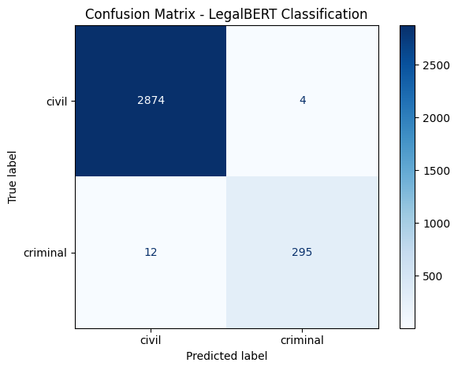

# legalbert-case-classifier

google colab environment for training a legalbert model ([nlpaueb/legal-bert-base-uncased](https://huggingface.co/nlpaueb/legal-bert-base-uncased)) as a binary case classifier (criminal vs civil)

## Data Preprocessing/Cleaning

(taken from the [Supreme Court E-Library](https://elibrary.judiciary.gov.ph/)) scraped at [sc-scraper](https://github.com/pj-pj-pj/sc-scraper).

- line breaks and tabs are replaced with ' '
- removed dates and numbers
- legal punctuation are preserved, excessive special chars are removed
- normalize whitespace

-> saved to cases_cleaned.csv

### Dataset Splitting

The dataset was partitioned into training (70%) and testing (20%) sets. To ensure the model is evaluated on a realistic distribution of cases, stratified sampling is used based on the `label` column.

### Handling Class Imbalance

To address the class imbalance in the dataset (Civil: 2878 samples, Criminal: 307 samples), class-weighted training is implemented.

**Weight Calculation:**

- Civil class weight: 0.5534457286868862
- Criminal class weight: 5.177642276422764

`WeightedTrainer` class uses `CrossEntropyLoss` with these computed weights, ensuring the Criminal class (minority) has approximately 9× more influence during training.

### Training Configuration

| Hyperparameter | Value |
| -------------- | ----- |
| Batch Size     | 8     |
| Epochs         | 1     |
| FP16           | True  |

## Final Model

### Training Output

| Epoch | Training Loss | Validation Loss | Accuracy | Precision Macro | Recall Macro | F1 Macro |
| --- | --- | --- | --- | --- | --- | --- |
| 1 | 0.273500 | 0.088990 | 0.994976 | 0.991232 | 0.979761 | 0.985411 |

`TrainOutput(global_step=1593, training_loss=0.14244856708456527, metrics={'train_runtime': 391.5887, 'train_samples_per_second': 32.526, 'train_steps_per_second': 4.068, 'total_flos': 3351245512120320.0, 'train_loss': 0.14244856708456527, 'epoch': 1.0})`

### Classification Report

|              | precision | recall | f1-score | support |
| ------------ | --------- | ------ | -------- | ------- |
| civil        | 0.9958    | 0.9986 | 0.9972   | 2878    |
| criminal     | 0.9866    | 0.9609 | 0.9736   | 307     |
|              |           |        |          |         |
| accuracy     |           |        | 0.9950   | 3185    |
| macro avg    | 0.9912    | 0.9798 | 0.9854   | 3185    |
| weighted avg | 0.9950    | 0.9950 | 0.9949   | 3185    |

### Confusion Matrix

